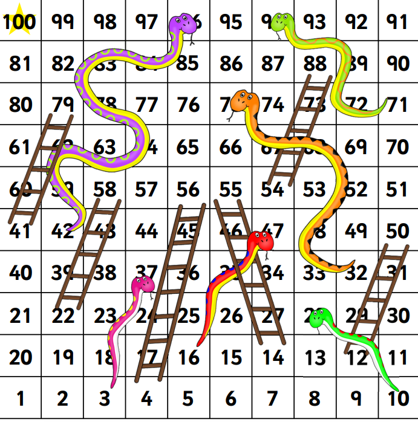

#### Snake and Ladder 

[An ancient indian game](https://en.wikipedia.org/wiki/Snakes_and_ladders)

* A board of 10x10 squares
* Usually a two player game
* Each player will roll dice alternatively
* Player moves to snake colum will be demoted
* Player moves to ladder will be promoted

